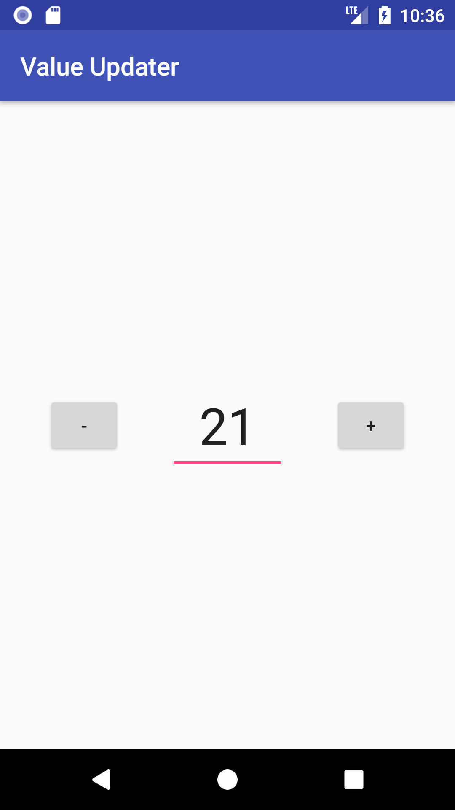

# ValueUpdater
A simple utility class that returns increased/decreased integer values between a defined range based on the event passed.

Clone or Download the repo for sample or to directly start using download the [ValueUpdater class](app/src/main/java/com/blogspot/pchub/valueupdater/ValueUpdaterHelper.java) :wink:

